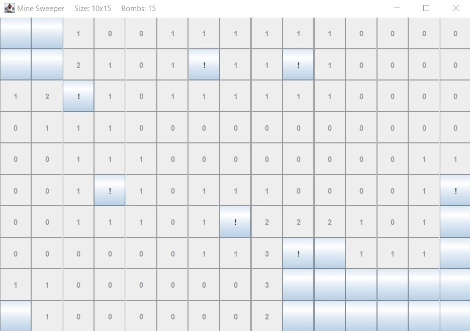

# java_MineSweeper
This is an implementation of a MineSweeper in java created for the lecture "Einführung in die Software-Entwicklung".<br />
Author: Eosandra Grund <br />
Date last modified: 29.07.2022 <br />
Play by navigating to the [bin](bin) folder and executing:
```
java mineSweeper.main.MineSweeper
```

## Game Mechanics 
* You can uncover a field using the *left mouse button*, it then shows the amount of neighboring bombs. If it was a bomb you loose and the game ends. If it does not have a neighboring bomb, all the neighbors are uncovered as well (rekursively). 
* If you think there is a bomb in one field you can use the *right mouse button* to mark it. When it is marked it cannot be uncovered, but you can remove the mark by clicking the right mouse button again. 
If you uncovered all the fields without bombs, you won the game. 

The View of a running game with 5x15 fields and 10 bombs. Marked fields have a "!".
<br clear="left"/>

## Model-View-Controller-Pattern and Observer-Pattern
I implemented the game using the _Model-View-Controller-Pattern_. 
The game and all the game mechanics are in the model containing the classes game and field. 
The controller contains all the controls and sends them to the model. 
The view creates the visuals using _Swing_ and is also an observer of the model so it can 
change the view depending on the changes in the game.
The _Observer-Pattern_ is implemented using _java.beans.PropertyChangeSupport_.

## Execution
1. Navigate to the [bin](bin) folder. 
2. Play by executing: 
```
java mineSweeper.main.MineSweeper
```
Which creates a default game with 10x10 fields and 10 bombs.

3. Or try your own combinations of sizes and bombs by using 
```
java mineSweeper.main.MineSweeper (x_dim y_dim (number_bombs))
```
this could for example result in
```
java mineSweeper.main.MineSweeper 5 15
```
Which reates a game with 5x15 fields and 5*15 / 10 = 7.5 ~ 7 bombs.<br />
Or: 
```
java mineSweeper.main.MineSweeper 10 15 15
```
Creates a game with 10x15 fields and 15 bombs